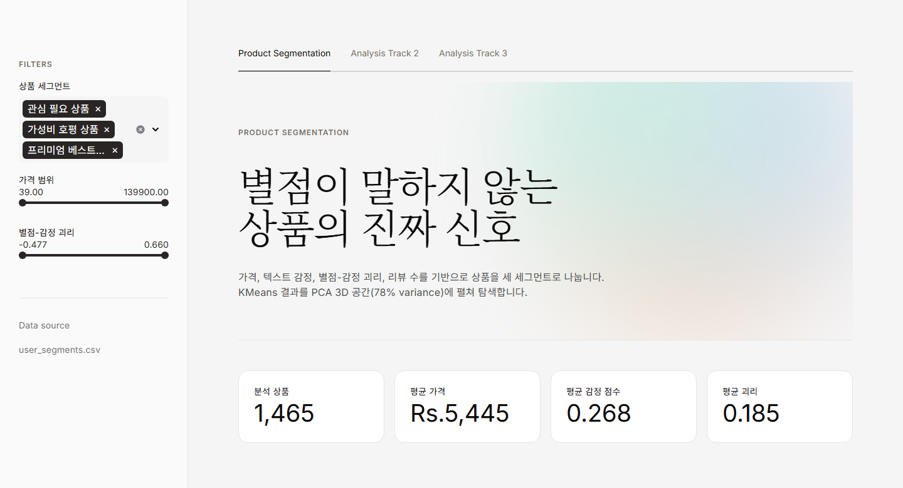
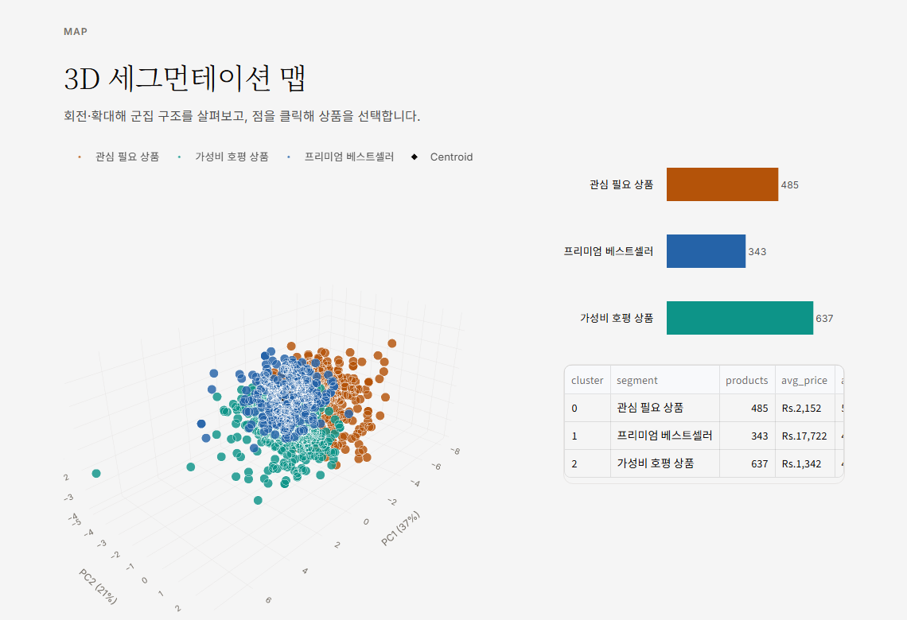

# Amazon Product Segmentation Dashboard

> 아마존 상품 리뷰 데이터를 **가격 · 리뷰 감정 · 별점-감정 괴리** 기준으로 3개 세그먼트로 나누고,
> PCA 3D 공간에서 인터랙티브하게 탐색하는 Streamlit 대시보드

<p>
  
  
  
  
  
</p>



---

## 프로젝트 소개

별점만으로는 상품의 실제 만족도를 알기 어렵습니다. **별점은 높은데 리뷰 텍스트는 불만인 상품**이 존재하기 때문입니다.
이 프로젝트는 별점과 리뷰 텍스트 감정의 **괴리(rating gap)** 를 핵심 피처로 삼아, 아마존 상품 1,465개를 세 갈래로 나눕니다.

| 세그먼트 | 상품 수 | 특징 | 운영 액션 |
|---|---:|---|---|
| 🔴 관심 필요 상품 | 485 | 별점은 높지만 텍스트 감정이 낮음 (별점 인플레이션 의심) | 품질 · 배송 · 상세페이지 우선 점검 |
| 🟠 프리미엄 베스트셀러 | 343 | 고가 · 리뷰 수 多 · 신뢰도 높음 | 할인보다 브랜드 · 로열티 전략 |
| 🔵 가성비 호평 상품 | 637 | 별점은 보수적이나 텍스트 감정이 좋음 | 긍정 리뷰 노출 강화로 전환 상승 |

---

## 실행 방법

```bash
git clone https://github.com/sohee-log/amazon-segmentation-dashboard.git
cd amazon-segmentation-dashboard

pip install -r requirements.txt
streamlit run app.py
```

브라우저에서 `http://localhost:8501` 로 접속하면 됩니다.
분석 결과 CSV가 저장소에 포함되어 있어 **별도 데이터 준비 없이 바로 실행**됩니다.

---

## 폴더 구조

```text
amazon-segmentation-dashboard/
├── app.py                              # Streamlit 대시보드 (진입점)
├── data/
│   ├── user_segments.csv               # 분석 결과 — 대시보드가 읽는 메인 데이터
│   ├── sample_user_segments.csv        # 폴백용 샘플 (메인 데이터 없을 때 사용)
│   └── model_metrics.csv               # k=2~6 KMeans/GMM 성능 비교표
├── notebooks/
│   └── 01_product_segmentation.ipynb   # 전처리 → 모델링 → 검증 전 과정
├── scripts/
│   └── export_segments.py              # 노트북 로직 재현 → data/*.csv 생성
├── members/                            # 팀원별 개인 작업 공간
├── .streamlit/config.toml              # 테마 설정
├── requirements.txt                    # 대시보드 실행용
└── requirements-pipeline.txt           # 데이터 재생성용
```

---

## 분석 파이프라인

### 1. 피처 엔지니어링

Kaggle [`karkavelrajaj/amazon-sales-dataset`](https://www.kaggle.com/datasets/karkavelrajaj/amazon-sales-dataset) 을 사용합니다.

| 피처 | 정의 |
|---|---|
| `discount_percentage` | 할인율 |
| `sentiment_score` | TextBlob 기반 리뷰 텍스트 감정 극성 (-1 ~ 1) |
| `rating_gap` | `rating/5 - (sentiment+1)/2` — **별점과 텍스트 감정의 괴리** |
| `log_actual_price` | 정가 로그 변환 (가격 왜도 보정) |
| `log_rating_count` | 리뷰 수 로그 변환 (인기도 왜도 보정) |

### 2. 모델 선정

`k=2~6` 구간에서 **K-Means와 GMM을 실루엣 · Davies-Bouldin · Calinski-Harabasz 세 지표로 비교**했습니다.
전 구간에서 K-Means가 우세했고, 최종적으로 해석 가능성을 우선해 **K-Means `k=3`** 을 채택했습니다.

| 모델 | k | Silhouette ↑ | Davies-Bouldin ↓ | Calinski-Harabasz ↑ |
|---|---:|---:|---:|---:|
| **KMeans** | **3** | **0.181** | **1.686** | **347.6** |
| GMM | 3 | 0.134 | 1.999 | 207.6 |

> 전체 비교표는 [`data/model_metrics.csv`](data/model_metrics.csv) 에 있습니다.
> k=2가 실루엣 점수는 더 높지만(0.204), 2개 군집은 "좋음/나쁨" 이분법이라 운영 액션으로 연결되지 않아 k=3을 선택했습니다.

### 3. 시각화

5개 피처를 **PCA 3차원으로 압축**(총 분산 77.5% 설명 — PC1 36.6% / PC2 21.4% / PC3 19.5%)하여 3D 산점도로 렌더링합니다.

---

## 대시보드 기능



- **3D 세그먼테이션 맵** — 회전 · 확대 가능한 Plotly 산점도, 세그먼트별 중심점(centroid) 표시
- **포인트 클릭 → 상품 상세** — 그래프에서 점을 클릭하면 해당 상품 정보가 아래 패널에 연결
- **실시간 필터** — 사이드바에서 세그먼트 · 가격대 · 괴리 범위로 즉시 필터링
- **세그먼트 플레이북** — 각 군집의 해석과 운영 액션 제안
- **탭 구조** — Tab 1은 상품 세그먼테이션, Tab 2 · 3은 팀원 분석 트랙

---

## 데이터 재생성 (선택)

저장소의 CSV를 직접 다시 만들고 싶다면:

```bash
pip install -r requirements-pipeline.txt
python scripts/export_segments.py
```

Kaggle 데이터셋을 자동 다운로드하므로 [Kaggle API 인증](https://www.kaggle.com/docs/api#authentication)이 필요합니다.
실행하면 `data/user_segments.csv`, `data/sample_user_segments.csv`, `data/model_metrics.csv` 가 갱신됩니다.

---

## 디자인

에디토리얼 매거진 톤을 따릅니다. off-white 캔버스(`#f5f5f5`)에 웜 니어블랙 잉크(`#0c0a09`),
채도 높은 CTA 색은 두지 않고, 파스텔 그라디언트 orb가 유일한 "색" 순간입니다.
display는 **weight 300**(Noto Serif KR), 본문은 Inter + Noto Sans KR, 섹션 리듬은 96px.

### 차트 색을 따로 파생시킨 이유

브랜드의 파스텔 orb(mint · peach · lavender · sky · rose)는 **분위기 전용**이라 데이터 마크로 쓸 수 없습니다.
off-white 캔버스 위에서 대비가 무너지기 때문입니다. 그래서 **같은 hue 계보는 유지하되 명도만 낮춘**
데이터 전용 팔레트를 파생시켰습니다.

| 세그먼트 | orb 계보 | 데이터 색 |
|---|---|---|
| 관심 필요 상품 | peach | `#b45309` |
| 프리미엄 베스트셀러 | sky | `#2563a8` |
| 가성비 호평 상품 | mint | `#0d9488` |

세 색은 대비(≥3:1) · 채도 하한 · 색각 이상 분리도(all-pairs)를 모두 통과합니다.
색만으로 정보를 나르지 않도록 범례를 항상 띄우고, 배지는 **점만 세그먼트 색이고 글자는 잉크**를 유지하며,
중심점은 색이 아니라 형태(잉크 다이아몬드)로 구분합니다.

---

## 팀

DACOS Team 2 토이 프로젝트입니다. 각 팀원의 작업은 [`members/`](members/) 폴더에 있습니다.

| 담당 | 폴더 | 파트 |
|---|---|---|
| sohee | [`members/sohee/`](members/sohee/) | Tab 1 — 상품 세그먼테이션 · 대시보드 |
| 팀원 B | [`members/member2/`](members/member2/) | Tab 2 — 분석 트랙 |
| 팀원 C | [`members/member3/`](members/member3/) | Tab 3 — 분석 트랙 |

협업 규칙과 시작 가이드는 [`members/README.md`](members/README.md) 를 참고하세요.

---

## 라이선스

[MIT License](LICENSE)
